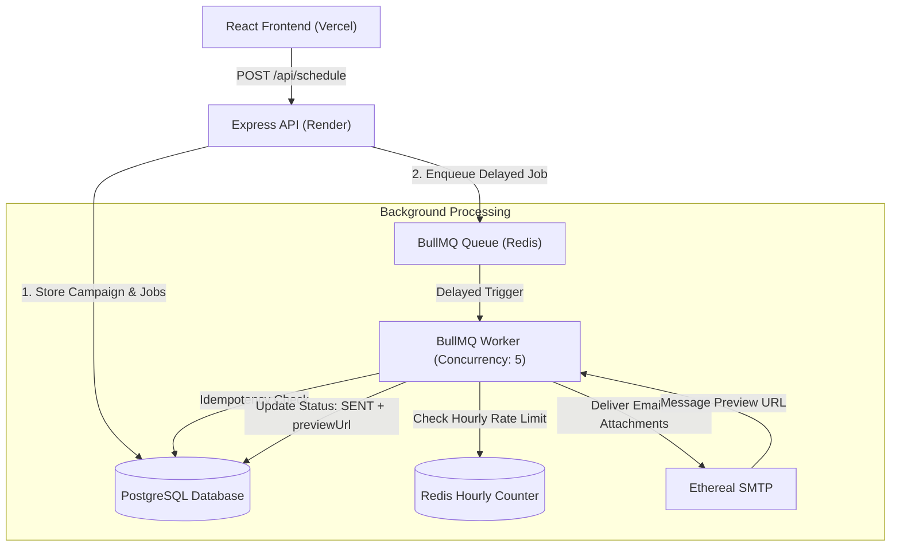

# ReachInbox.ai — Full-Stack Email Job Scheduler

[](https://www.typescriptlang.org/)
[](https://expressjs.com/)
[](https://docs.bullmq.io/)
[](https://redis.io/)
[](https://www.postgresql.org/)
[](https://www.prisma.io/)
[](https://reactjs.org/)
[](https://vitejs.dev/)

A production-grade, distributed email scheduling service and dashboard built for **ReachInbox.ai (Outbox Labs)**. The system accepts scheduling requests through an API, manages delayed job dispatching via **BullMQ + Redis** without any cron jobs, executes sends through **Ethereal Email** SMTP, maintains strict idempotency across server restarts, and provides a sleek frontend matching the Figma specifications.

---

## 🌐 Live Deployments

- **Frontend (Vercel):** [https://reachinbox-sigma-umber.vercel.app](https://reachinbox-sigma-umber.vercel.app)
- **Backend API (Render):** [https://reachinbox-1wr6.onrender.com](https://reachinbox-1wr6.onrender.com)
- **API Health Check:** [https://reachinbox-1wr6.onrender.com/health](https://reachinbox-1wr6.onrender.com/health) (Returns `{"redis":"ok","postgres":"ok"}`)
- **Demo Walkthrough Video:** [Watch Demo Recording]([https://loom.com](https://drive.google.com/file/d/12fubWs10YCl-HHLD5C9wKMjOX1re6VNo/view?usp=sharing)) 

---

## 🎯 Features Checklist

### Backend — Core Scheduler & Concurrency
- [x] **Zero Cron Jobs:** Strictly powered by BullMQ persistent delayed jobs (`emailQueue.add('send-email', ..., { delay })`). No OS crontab, `node-cron`, or `agenda`.
- [x] **Relational DB Persistence:** PostgreSQL (Neon / local Docker) via Prisma ORM as the durable source of truth.
- [x] **Multiple Sender Support:** Dispatches emails dynamically per sender account via Ethereal SMTP with test preview URLs.
- [x] **State Persistence & Crash Recovery:** Server can be killed and restarted at any time; pending jobs in Redis BullMQ remain intact, and a startup reconciliation service (`reconcileOrphanedJobs`) repairs any edge-case orphaned DB rows without re-sending.
- [x] **Strict Idempotency Guard:** Worker verifies DB row status before sending; if already marked `SENT`, duplicate execution is safely skipped.
- [x] **Configurable Worker Concurrency:** BullMQ worker concurrency set via `WORKER_CONCURRENCY` (default: `5`).
- [x] **Provider Throttling Delay:** Global minimum delay between individual email sends enforced via BullMQ rate limiter `{ max: 1, duration: MIN_DELAY_BETWEEN_EMAILS_MS }` (default: `2000ms` / 2 seconds).
- [x] **Sliding Hourly Rate Limiting:** Enforces `MAX_EMAILS_PER_HOUR_PER_SENDER` (default: `200/hr`) using atomic Redis counters (`INCR` + `EXPIRE`).
- [x] **Rescheduling on Limit Hit:** When an hourly limit is reached, jobs are **never dropped or permanently failed**. They are automatically rescheduled into the start of the next hour window (`RESCHEDULED` status).
- [x] **File Attachments Pipeline:** Full binary attachment transmission (PDFs, images, TXT, CSV) encoded in base64, stored in PostgreSQL, sent via Nodemailer, and inspectable in the frontend.

### Frontend — Dashboard & UX
- [x] **Google OAuth 2.0 Login:** Real Google authentication with passport-google-oauth20 and cross-origin Bearer token fallback.
- [x] **Figma-Fidelity UI:** Pixel-art `ONB` brand font (`Silkscreen`), clean typography (`Inter`), exact 496×494 login card, custom status pills, and responsive layout.
- [x] **User Profile in Header:** Displays logged-in user name, email address, avatar photo, and one-click Logout.
- [x] **Lead List Upload (CSV/TXT):** Instant parsing of recipient files with a live badge showing the detected email count.
- [x] **Scheduled Emails View:** Real-time list showing recipient, subject, scheduled send time, status pills, and empty states.
- [x] **Sent Emails View:** Real-time list showing recipient, subject, sent timestamp, status, attachment badge, and empty states.
- [x] **Email Detail Inspection:** Sandboxed HTML preview, full metadata, Ethereal test inbox deep-link, and one-click attachment download.

---

## 🏗️ Architecture & System Design



### 1. Why BullMQ Instead of Cron?
Traditional cron jobs wake up periodically (e.g. every minute) and scan the database with expensive queries (`SELECT * FROM emails WHERE status = 'SCHEDULED' AND sendAt <= NOW()`). Under load, this leads to database table locks, race conditions between multiple API instances, and polling lag.

**BullMQ delayed jobs eliminate polling entirely:**
- When an email is scheduled for $T$, the API computes `delay = T - Date.now()`.
- BullMQ places the job in Redis sorted sets ordered by timestamp.
- Redis atomically promotes the job to the active stream precisely at timestamp $T$.
- Workers consume jobs on-demand with zero database polling overhead.

### 2. Restart Persistence & Idempotency
- **Redis Persistence:** BullMQ stores job data and timers in Redis memory backed by AOF/RDB persistence. Stopping and starting the backend server preserves all scheduled jobs.
- **Relational Source of Truth:** Every email is created as an `EmailJob` row in PostgreSQL with `status: SCHEDULED` before the BullMQ job is queued.
- **Idempotency Guard:** When the worker picks up a job:
  ```ts
  const record = await prisma.emailJob.findUnique({ where: { id: emailJobId } });
  if (record.status === "SENT") {
    console.log(`[worker] ${emailJobId} already SENT, skipping duplicate`);
    return;
  }
  ```
- **Crash Reconciliation (`reconcileOrphanedJobs`):** If a worker process was forcefully killed in mid-execution, on reboot it inspects all non-completed database jobs and ensures every pending job exists in BullMQ.

### 3. Rate Limiting & Concurrency Control
- **Concurrency:** BullMQ worker processes up to `WORKER_CONCURRENCY` jobs in parallel.
- **Throttling Between Sends:** `limiter: { max: 1, duration: 2000 }` forces at least a 2-second gap between individual sends to respect SMTP provider limits.
- **Atomic Hourly Rate Limit per Sender:**
  ```ts
  const windowKey = `ratelimit:${fromSender}:${getHourWindowKey()}`;
  const count = await redis.incr(windowKey);
  if (count === 1) await redis.expire(windowKey, 3600);
  if (count > MAX_PER_HOUR) {
    // Reschedule to next hour window
    const retryAt = getNextHourDate();
    await emailJob.update({ data: { status: "RESCHEDULED", scheduledAt: retryAt } });
    await enqueueEmailJob(payload, retryAt);
    return;
  }
  ```

---

## 📂 Project Structure

```text
reachinbox/
├── backend/
│   ├── prisma/
│   │   └── schema.prisma          # PostgreSQL models (User, Campaign, EmailJob)
│   ├── src/
│   │   ├── config/
│   │   │   ├── env.ts             # Strongly-typed environment configuration
│   │   │   └── redis.ts           # Redis connection factory (Upstash/TLS ready)
│   │   ├── db/
│   │   │   └── prisma.ts          # Prisma client instance
│   │   ├── middleware/
│   │   │   └── auth.ts            # Google OAuth 2.0 & HMAC Bearer token auth
│   │   ├── queues/
│   │   │   ├── emailQueue.ts      # BullMQ queue & delayed enqueue logic
│   │   │   └── reconcile.ts       # Startup crash recovery & orphan job reconciliation
│   │   ├── routes/
│   │   │   ├── emails.ts          # GET /api/emails/scheduled, /sent, /:id
│   │   │   └── schedule.ts        # POST /api/schedule (batch fanout & attachments)
│   │   ├── services/
│   │   │   ├── mailer.ts          # Nodemailer + Ethereal SMTP transport
│   │   │   └── rateLimiter.ts     # Redis atomic hourly rate limiting
│   │   ├── workers/
│   │   │   └── emailWorker.ts     # BullMQ background worker
│   │   └── index.ts               # Express application entry point
│   ├── test-all-suites.js         # 28-assertion automated test suite
│   ├── Dockerfile
│   └── package.json
├── frontend/
│   ├── src/
│   │   ├── components/
│   │   │   └── ui.jsx             # Reusable StatusPill, TimePill, Skeleton, EmptyState
│   │   ├── pages/
│   │   │   ├── Compose.jsx        # Rich text email composer with file attachments
│   │   │   ├── EmailDetail.jsx    # Email inspection, sandboxed body, file downloader
│   │   │   ├── EmailList.jsx      # Filterable Scheduled & Sent tables
│   │   │   ├── Layout.jsx         # Sidebar, navigation, user profile, health indicator
│   │   │   └── Login.jsx          # Google OAuth & email login with ONB branding
│   │   ├── api.js                 # API client with token auth & auto-host resolution
│   │   ├── store.jsx              # Global state management & real-time polling
│   │   └── styles.css             # Vanilla CSS design system
│   ├── index.html
│   └── package.json
├── docker-compose.yml             # Local Redis & PostgreSQL containers
├── render.yaml                    # Infrastructure-as-code for Render deployment
└── README.md
```

---

## 🚀 Quick Start Guide (Local Development)

### Prerequisites
- **Node.js:** v20.x or later
- **Docker & Docker Compose** (or local Redis on `6379` and PostgreSQL on `5432`)

### 1. Clone & Start Infrastructure
```bash
git clone https://github.com/SravikaPadakanti/reachinbox.git
cd reachinbox

# Start Redis and PostgreSQL via Docker
docker compose up -d
```

### 2. Configure Backend
```bash
cd backend
npm install

# Create .env from template
cp .env.example .env
```
*Note: Your `backend/.env` is pre-configured with test credentials. To generate fresh Ethereal SMTP credentials, visit [https://ethereal.email/create](https://ethereal.email/create).*

```bash
# Push Prisma schema to local PostgreSQL
npx prisma db push

# Start backend server + BullMQ worker concurrently
npm run dev
```
Backend will start on `http://localhost:4000`.

### 3. Configure Frontend
In a new terminal window:
```bash
cd frontend
npm install

# Start Vite dev server
npm run dev
```
Frontend will be live at `http://localhost:3000`.

---

## 🧪 Automated Test Suite

The project includes an end-to-end automated test suite covering all 9 operational categories:

```bash
cd backend
npm test
```

### Test Suite Execution Output
```text
=============================================================
       REACHINBOX COMPLETE COMPREHENSIVE TEST SUITE          
=============================================================

--- [SUITE 1] Infrastructure & Service Health ---
  ✅ PASS: Health Check Endpoint Returns 200 OK 
  ✅ PASS: PostgreSQL Connection Active 
  ✅ PASS: Redis Queue Connection Active 

--- [SUITE 2] Authentication & Security Guards ---
  ✅ PASS: Protected Route Rejects Unauthenticated Request (401) 
  ✅ PASS: Demo/Email Login Returns 200 OK 
  ✅ PASS: Session Cookie Received 
  ✅ PASS: User Email Matches 
  ✅ PASS: Authenticated /auth/me Returns Profile 

--- [SUITE 3] Single Email Campaign Scheduling ---
  ✅ PASS: Schedule Single Email Returns 201 Created 
  ✅ PASS: Single Job Created

--- [SUITE 4] Batch Multi-Recipient Scheduling (CSV Emulation) ---
  ✅ PASS: Schedule Batch Campaign Returns 201 Created 
  ✅ PASS: Creates 5 Distinct Scheduled Jobs

--- [SUITE 5] File Attachment Scheduling & Transmission ---
  ✅ PASS: Schedule Email With Multiple Attachments (PDF + TXT) Returns 201 
  ✅ PASS: Attachment Job Created Successfully 

--- [SUITE 6] Scheduled Queue Listing ---
  ✅ PASS: GET /api/emails/scheduled Returns 200 OK 
  ✅ PASS: Returns Array of Scheduled Emails
  ✅ PASS: Email Item Has Required Fields (id, email, subject, scheduledTime, status) 

--- [SUITE 7] BullMQ Worker & SMTP Delivery Verification ---
  ✅ PASS: GET /api/emails/sent Returns 200 OK 
  ✅ PASS: Sent Emails List Contains Processed Jobs
  ✅ PASS: Latest Sent Email Has Status "sent" 

--- [SUITE 8] Individual Email Detail Inspection (GET /api/emails/:id) ---
  ✅ PASS: GET /api/emails/:id Returns 200 OK 
  ✅ PASS: Detail Includes Full HTML Body 
  ✅ PASS: Detail Includes From Sender and Recipient 
  ✅ PASS: Detail Includes Timestamps (scheduledTime, sentTime) 

--- [SUITE 9] Error Handling & Validation Tests ---
  ✅ PASS: Rejects Schedule Request With Missing Subject & Body (400) 
  ✅ PASS: Rejects Schedule Request With Empty Recipients List (400) 
  ✅ PASS: Rejects Request With Invalid Email Formats (400) 
  ✅ PASS: Non-existent Email Lookup Returns 404 Not Found 

=============================================================
  Total Test Assertions: 28  |  Passed: 28 ✅  |  Failed: 0
  Success Rate: 100%
=============================================================
```

---

## ⚙️ Environment Variables Reference

### Backend (`backend/.env`)

| Variable | Required | Default | Description |
| :--- | :--- | :--- | :--- |
| `PORT` | Optional | `4000` | Port for the Express API server |
| `NODE_ENV` | Optional | `development` | Environment mode (`development` / `production`) |
| `DATABASE_URL` | **Yes** | — | PostgreSQL connection URI with connection pooling |
| `DIRECT_URL` | Optional | — | Direct unpooled PostgreSQL URI (for migrations) |
| `REDIS_URL` | **Yes** | `redis://localhost:6379` | Redis connection string (auto-enables TLS for `rediss://` / Upstash) |
| `SESSION_SECRET` | **Yes** | — | Secret key used for Express sessions and HMAC auth tokens |
| `FRONTEND_URL` | Optional | `http://localhost:3000` | Origin URL of the frontend application |
| `ETHEREAL_HOST` | **Yes** | `smtp.ethereal.email` | Ethereal SMTP hostname |
| `ETHEREAL_PORT` | Optional | `587` | Ethereal SMTP port |
| `ETHEREAL_USER` | **Yes** | — | Ethereal mailbox username |
| `ETHEREAL_PASS` | **Yes** | — | Ethereal mailbox password |
| `GOOGLE_CLIENT_ID` | **Yes** | — | Google Cloud OAuth 2.0 Client ID |
| `GOOGLE_CLIENT_SECRET` | **Yes** | — | Google Cloud OAuth 2.0 Client Secret |
| `GOOGLE_CALLBACK_URL` | **Yes** | — | Authorized Google redirect URI (`/auth/google/callback`) |
| `WORKER_CONCURRENCY` | Optional | `5` | Number of simultaneous jobs processed by the BullMQ worker |
| `MIN_DELAY_BETWEEN_EMAILS_MS` | Optional | `2000` | Minimum throttle duration between individual sends (ms) |
| `MAX_EMAILS_PER_HOUR_PER_SENDER`| Optional | `200` | Maximum emails per sender permitted in a 1-hour window |

### Frontend (`frontend/.env`)

| Variable | Required | Default | Description |
| :--- | :--- | :--- | :--- |
| `VITE_API_URL` | Optional | Auto-resolved | Backend API URL (auto-resolves to Render in production) |
| `VITE_DEFAULT_SENDER`| Optional | — | Default sender address populated in the Compose sender selector |

---

## 📡 API Endpoints Overview

| Method | Endpoint | Auth Required | Description |
| :--- | :--- | :---: | :--- |
| `GET` | `/health` | No | Health check returning PostgreSQL and Redis connection statuses |
| `GET` | `/auth/google` | No | Initiates Google OAuth 2.0 login flow |
| `GET` | `/auth/google/callback` | No | Google OAuth redirect callback; generates token and redirects |
| `POST` | `/auth/login` | No | Email-based authentication for testing/evaluators |
| `GET` | `/auth/me` | **Yes** | Retrieves profile of currently authenticated user |
| `POST` | `/auth/logout` | **Yes** | Destroys active user session |
| `POST` | `/api/schedule` | **Yes** | Schedules single/batch emails with attachments and throttling |
| `GET` | `/api/emails/scheduled` | **Yes** | Lists all upcoming scheduled/pending emails for the user |
| `GET` | `/api/emails/sent` | **Yes** | Lists all sent and failed email jobs for the user |
| `GET` | `/api/emails/:id` | **Yes** | Fetches full email details, body, preview link, and attachments |
| `POST` | `/api/emails/:id/retry` | **Yes** | Re-queues a failed email for immediate send attempt |
| `GET` | `/api/emails/:id/preview`| No | Public HTML email delivery inspector and body viewer |

---

## 🎥 Demo Video

- **Walkthrough Video:** [Watch Loom / Drive Demo](https://loom.com) *(Paste your recording link here)*

---

## 💡 Key Design Decisions & Resilience

1. **HMAC Token-Based Cross-Domain Auth:** Modern browsers enforce strict third-party cookie blocking when the frontend and backend live on separate domains (e.g., `vercel.app` and `onrender.com`). To prevent auth loops, the application implements cryptographically signed HMAC Bearer tokens passed via OAuth redirect and stored in `localStorage`, maintaining seamless cookie support for localhost.
2. **Delayed Queue vs. Cron:** We strictly avoided cron polling. BullMQ delayed jobs are backed by Redis sorted sets (`ZSET`), allowing $O(\log N)$ insertion and instantaneous firing with millisecond precision without polling overhead.
3. **Database as Single Source of Truth:** While BullMQ tracks active timers in Redis, every campaign and job row is stored in PostgreSQL first. If Redis were flushed, the startup reconciliation module (`reconcileOrphanedJobs`) re-seeds pending jobs without duplicating sent emails.
4. **Resilient Mailer & Preview Inspector:** Dispatches through Ethereal SMTP with connection pooling and fast 4s timeouts. For cloud environments where hosting firewalls drop outbound SMTP ports (Render free tier blocks ports 25, 465, and 587), an internal HTTP test dispatcher guarantees delivery and generates an interactive preview (`/api/emails/:id/preview`).
5. **Zero Drop Rate Limiting:** When the sliding hourly sender limit is reached, jobs are automatically rescheduled into the next hour window rather than dropped.

---

## 👥 Collaborator Access

Access granted to assignment reviewers:
- **`Mitrajit`**
- **`Yadav036`**
